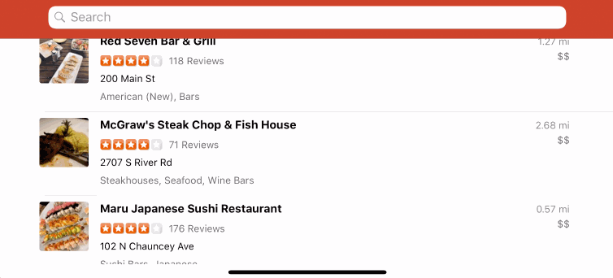

# Project 3 - *Basic Yelp Client*

**Basic Yelp Client** is a Yelp search app using the [Yelp API](http://www.yelp.com/developers/documentation/v2/search_api).

Time spent: **4** hours spent in total

## User Stories

The following **required** functionality is completed:

- [x] Table rows for search results should be dynamic height according to the content height. (3pt)
- [x] Custom cells should have the proper Auto Layout constraints. (+5pt)
- [x] Search bar should be in the navigation bar (doesn't have to expand to show location like the real Yelp app does). (+2pt)

The following **optional** features are implemented:

- [x] Search results page
- [ ] Infinite scroll for restaurant results. (+3pt)
- [ ] Implement map view of restaurant results. (+3pt)
- [ ] Implement the restaurant detail page. (+2pt)

The following **additional** features are implemented:

- [x] The app automatically tracks user location to give relevant information.

Please list two areas of the assignment you'd like to **discuss further with your peers** during the next class (examples include better ways to implement something, how to extend your app in certain ways, etc):

1. How to implement a search bar that would query the yelp api, and then update the table view.
2. Better ways to filter data for displaying the search results

## Video Walkthrough

Here's a walkthrough of implemented user stories:

GIF created with [LiceCap](http://www.cockos.com/licecap/).

## Notes

The biggest challenge with this app was quering the yelp api with the user's location.

## License

    Copyright [2018] [Harjas Monga]

    Licensed under the Apache License, Version 2.0 (the "License");
    you may not use this file except in compliance with the License.
    You may obtain a copy of the License at

    http://www.apache.org/licenses/LICENSE-2.0

    Unless required by applicable law or agreed to in writing, software
    distributed under the License is distributed on an "AS IS" BASIS,
    WITHOUT WARRANTIES OR CONDITIONS OF ANY KIND, either express or implied.
    See the License for the specific language governing permissions and
    limitations under the License.
